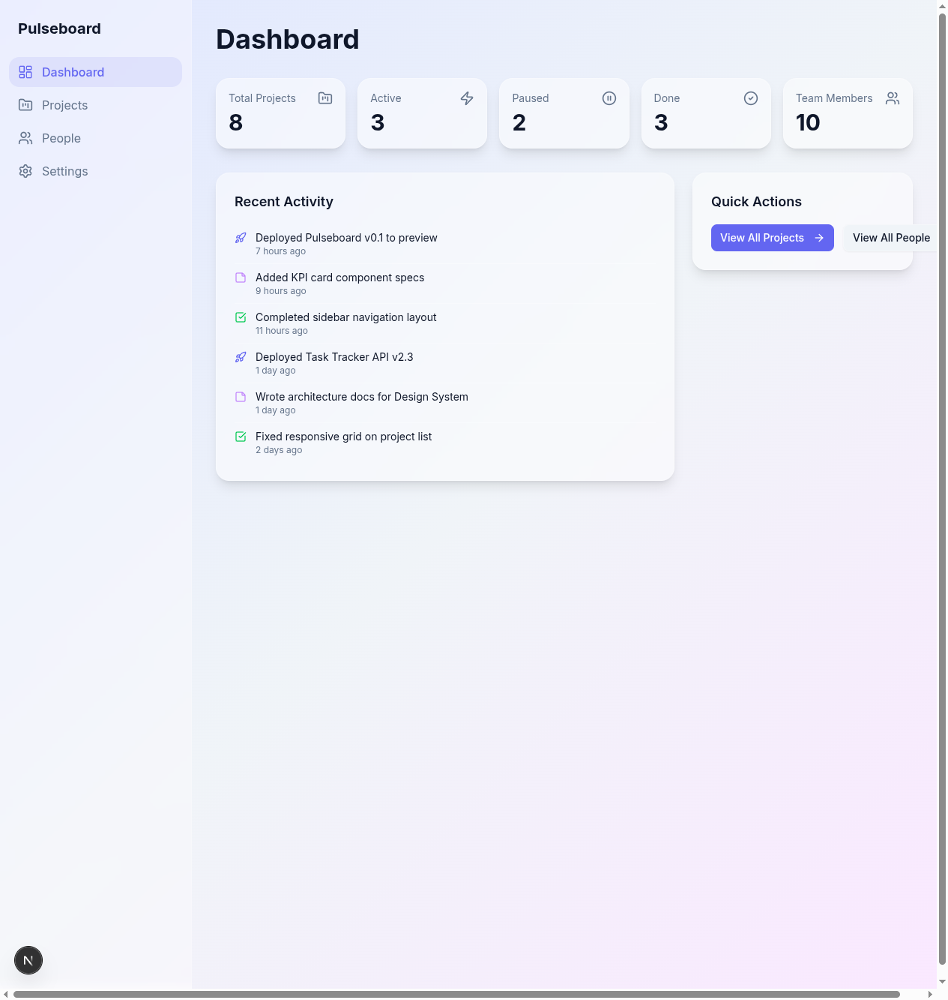

# Pulseboard

A personal dashboard UI for tracking projects and team members, built with Next.js App Router, TypeScript, and PostgreSQL.



## Features

- **Dashboard** — KPI cards, recent activity feed, quick actions
- **Projects** — List with search, status filtering (Active/Paused/Done), detail pages with team members
- **People** — List with search, role filtering (Stakeholder/Lead/Member), detail pages with project assignments
- **Cross-linking** — Navigate between projects and people seamlessly
- **Glassmorphism design** — Frosted glass UI with responsive layout

## Tech Stack

- **Framework:** [Next.js 16](https://nextjs.org/) (App Router, Server Components)
- **Language:** TypeScript (strict mode)
- **Styling:** Tailwind CSS 4 + shadcn/ui
- **Database:** PostgreSQL via [Prisma 7](https://www.prisma.io/) ORM
- **Icons:** Lucide React

## Getting Started

### Prerequisites

- Node.js 20+
- PostgreSQL database

### Setup

```bash
# Install dependencies
npm install

# Configure environment
cp .env.example .env
# Edit .env with your PostgreSQL connection string

# Generate Prisma client
npx prisma generate

# Run migrations and seed data
npx prisma migrate dev

# Start dev server
npm run dev
```

Open [http://localhost:3000](http://localhost:3000) to view the app.

## Project Structure

```
src/
├── app/                    # Next.js App Router pages
│   ├── page.tsx            # Dashboard
│   ├── projects/           # Project list + detail
│   └── people/             # People list + detail
├── components/
│   ├── ui/                 # shadcn/ui primitives
│   ├── layout/             # Sidebar, Shell
│   ├── dashboard/          # KPI cards, Activity feed
│   ├── projects/           # Project card, Search, Status filter
│   └── people/             # Person card, Search, Role filter
├── lib/
│   ├── db.ts               # Prisma client singleton
│   ├── prisma-extensions.ts # Soft delete extension
│   ├── services/           # Async data access layer
│   ├── types/              # Re-exported Prisma types
│   └── utils.ts            # Helpers (cn, formatRelativeTime)
prisma/
├── schema.prisma           # Database schema
├── migrations/             # SQL migrations
└── seed.ts                 # Seed data (8 projects, 10 people)
```

## Scripts

| Command | Description |
|---|---|
| `npm run dev` | Start dev server |
| `npm run build` | Production build |
| `npm run lint` | Run ESLint |
| `npm run db:studio` | Open Prisma Studio |
| `npm run db:seed` | Re-seed the database |

## Documentation

- [`docs/architecture.md`](docs/architecture.md) — Page structure, data flow, component hierarchy
- [`docs/components.md`](docs/components.md) — Component inventory with props
- [`docs/data-model.md`](docs/data-model.md) — Database schema and relationships
- [`docs/database.md`](docs/database.md) — Database setup and migration workflow
- [`docs/style-guide.md`](docs/style-guide.md) — Design tokens and glassmorphism system
